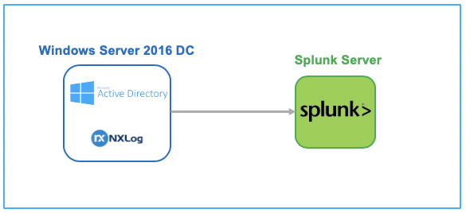

# Attack Range
The Attack Range is used to generate datasets for the Attack Data Project. More information about the Attack range can be found [here](https://github.com/splunk/attack_range).  
The Splunk server and Windows Server 2016 Domain Controller are used to generate Attack datasets.

## Machines
This environment consists of a Windows Server 2016 Domain Controller and a Splunk server. A NXLog agent is used to store Windows Event Logs (Sysmon, Security, System, Application) in json format.

## Users
This environment uses the default Administrator user with password I-l1ke-Attack-Range!.
