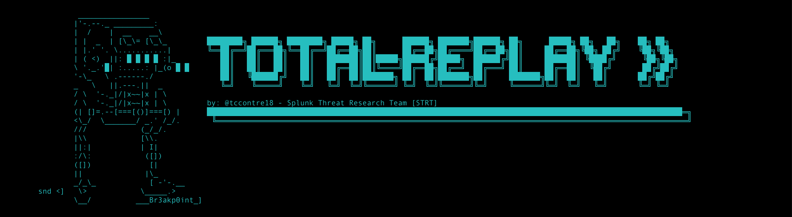
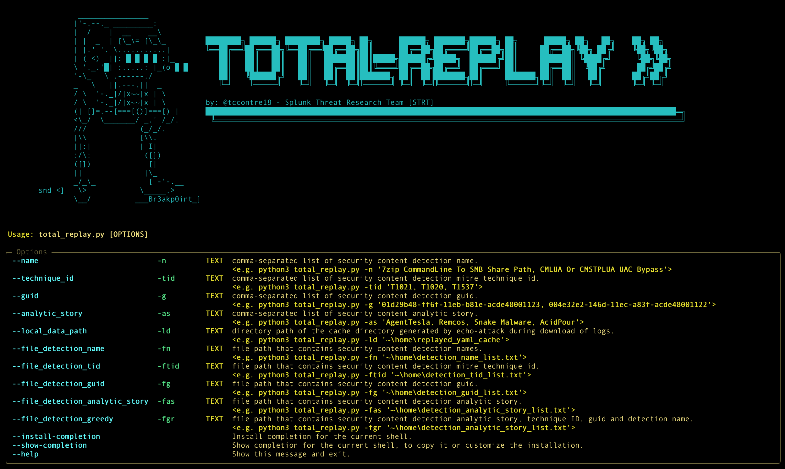

# TOTAL-REPLAY



## Description

This lightweight tool helps you make the most of Splunk’s [Security Content](https://github.com/splunk/security_content) metadata, such as detection names, analytic stories, and more, by replaying relevant test event logs or attack data from either the [Splunk Attack Data](https://github.com/splunk/attack_data) or [Splunk Attack Range](https://github.com/splunk/attack_range) projects.

## Installation

### MAC/LINUX:
---

1. Clone the Splunk Attack Data github repo. We recommend to follow this steps [Attack Data Getting Started](https://github.com/splunk/attack_data/).

2. Clone the Splunk Security Content github repo. We recommend to follow this steps [Security Content Getting Started](https://github.com/splunk/security_content).

3. Install Poetry (if not already installed)
```
curl -sSL https://install.python-poetry.org/ | python3 -
```
4. Navigate to your project directory
```
cd /path/to/your/total-replay-project
```
5. Create a virtual environment and activate it
```
poetry shell
```
6. Install project dependencies
```
poetry install
```
7. In total_replay->configuration->config.yml, add the folder path of the Splunk Attack Data repo and the detection folder path in Splunk Security Content.

```
settings:
  security_content_detection_path: ~/path/to/your/security_content/detections
  attack_data_dir_path: ~/path/to/your/attack_data
```

8. make sure you setup the required environment variables for splunk server connection

    | Environment Variables.     | Description             |
    |----------------------------|-------------------------|
    | **SPLUNK_HOST**            | SPLUNK HOST IP ADDRESS  |
    | **SPLUNK_HEC_TOKEN**       | SPLUNK SERVER HEC TOKEN |

    you can use the `export` commandline function for adding these environment variables

    ```
    export SPLUNK_HOST= <IP_ADDRESS>
    export SPLUNK_HEC_TOKEN= <SPLUNK_HEC_TOKEN>
    ```

9. Make sure HEC token is set to "Enabled" in Splunk server (Settings → Data Inputs → HTTP Event Collector).

10. Confirm the HEC listener port is enabled, typically 8088, using HTTPS.

11. Update your firewall settings to allow inbound connections on port 8088, otherwise your data sender will not be able to reach Splunk.

### Windows OS:

We recommend using the Windows Subsystem for Linux (WSL). You can find a tutorial [here](https://learn.microsoft.com/en-us/windows/wsl/install). After installing WSL, you can follow the steps described in the Linux section.


### OPTIONAL:
- You can toggle the `debug_print` configuration setting of TOTAL-REPLAY to disable or enable debug print during execution.


## Usage



### Features

A. This tool accepts the following types of metadata as input:

    - **Splunk detection names**
    - **MITRE ATT&CK tactic and technique IDs**
    - **Splunk detection GUIDs**
    - **Analytic stories**

  It then uses these inputs to identify and replay the attack data associated with them.

  Example A - Replay Attack Data via Splunk detection name:

  ```
  python3 total_replay.py -n '7zip CommandLine To SMB Share Path, CMLUA Or CMSTPLUA UAC Bypass'
  ```


B. For automation, you can also provide a simple .txt file.
For example:

**test.txt**:

```
wsreset_uac_bypass.yml
wscript_or_cscript_suspicious_child_process.yml
windows_user_deletion_via_net.yml
Windows User Disabled Via Net
Windows Chromium Browser No Security Sandbox Process
004e32e2-146d-11ec-a83f-acde48001122
01d29b48-ff6f-11eb-b81e-acde48001123
#T1014
T1589.001
Amos Stealer
PromptLock
f64579c0-203f-11ec-abcc-acde48001122
004e32e2-146d-11ec-a83f-acde48001122
```

This file can contain any mix of Security Content metadata you want to replay.
From there, you can choose whether to replay only detection GUIDs, only analytic stories, or all entries using the tool’s greedy replay feature.

C. TOTAL-REPLAY downloads the required Attack Data each time you execute or replay data during detection testing or development. To help reduce disk space usage, the tool generates a cached .yml file for every downloaded dataset. You can then use the `local_data_path` parameter to replay the cached data, allowing you to avoid downloading the same Attack Data again.

### Other

For replaying captured datasets or event logs during detection development or testing outside of the Splunk Security Content or Splunk Attack Data GitHub repositories, we recommend using the built-in replay.py feature provided by either Splunk Attack Range or Attack Data.

If you have multiple datasets to replay and your metadata matches the format required by TOTAL-REPLAY for caching downloaded datasets, you can recreate that format and use the `local_data_path` feature to replay the data directly from the cache.

Below is an example of the cached .yml file generated by TOTAL-REPLAY after replaying datasets:

```
analytic_story:
- Ransomware
attack_data_link: https://media.githubusercontent.com/media/splunk/attack_data/master/datasets/malware/conti/conti_leak/windows-sysmon_7z.log
attack_data_output_file_path: /Users/tecontre/Research/lab/attack_range/total_replay/output/2025-11-18/detection_name_replay_c2ffd320-bcd3-4d88-9d12-57bdd30f6545/01d29b48-ff6f-11eb-b81e-acde48001123/windows-sysmon_7z.log
attack_data_source: XmlWinEventLog:Microsoft-Windows-Sysmon/Operational
attack_data_sourcetype: XmlWinEventLog
description: The following analytic detects the execution of 7z or 7za processes with
  command lines pointing to SMB network shares. It leverages data from Endpoint Detection
  and Response (EDR) agents, focusing on process names and command-line arguments.
  This activity is significant as it may indicate an attempt to archive and exfiltrate
  sensitive files to a network share, a technique observed in CONTI LEAK tools. If
  confirmed malicious, this behavior could lead to data exfiltration, compromising
  sensitive information and potentially aiding further attacks.
id: 01d29b48-ff6f-11eb-b81e-acde48001123
mitre_attack_id:
- T1560.001
name: 7zip CommandLine To SMB Share Path

```

## Author

* [Teoderick Contreras](https://www.linkedin.com/in/teoderickc/)

## License

Copyright 2025 Splunk Inc.

Licensed under the Apache License, Version 2.0 (the "License");
you may not use this file except in compliance with the License.
You may obtain a copy of the License at

http://www.apache.org/licenses/LICENSE-2.0

Unless required by applicable law or agreed to in writing, software
distributed under the License is distributed on an "AS IS" BASIS,
WITHOUT WARRANTIES OR CONDITIONS OF ANY KIND, either express or implied.
See the License for the specific language governing permissions and
limitations under the License.